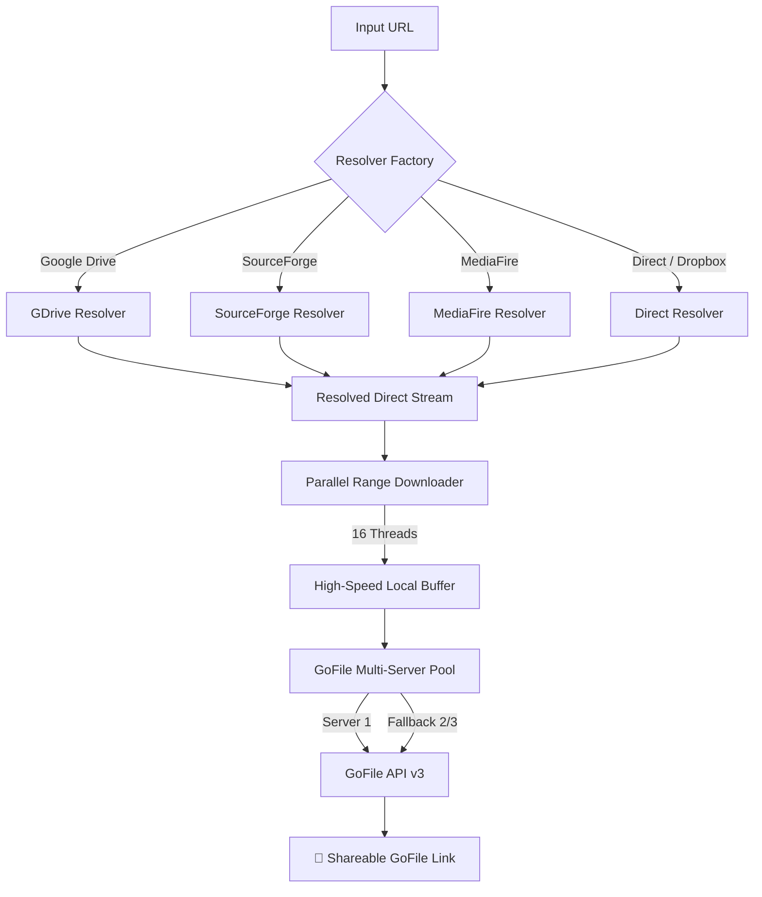

# 🚀 GoFile Fast Link Transfer

<div align="center">


[](https://opensource.org/licenses/MIT)
[](https://www.python.org/downloads/)
[](https://gofile.io/api)
[]()

**The fastest, single-job engine to download any file from any hosting platform and upload directly to GoFile.**

[Quick Start](#-quick-start) •
[Features](#-key-features) •
[Web Dashboard](#-web-dashboard) •
[Architecture](#-architecture) •
[Supported Hosts](#-supported-hosts) •
[CLI Reference](#-cli-reference)

</div>

---

## ⚡ Quick Start

### 1. Installation
```bash
git clone https://github.com/sheikhmehraann/gofile-fast-link-transfer.git
cd gofile-fast-link-transfer
pip install -r requirements.txt
```

### 2. Single-Job Execution (Ek Hi Job)
```bash
# Direct link transfer
python main.py "https://example.com/any-file.zip"

# Or simply run and paste link interactively:
python main.py

# Windows Double-Click Launcher:
run.bat
```

### 3. Web Dashboard (Browser Interface)
```bash
python web_app.py
# Open http://localhost:5000 in your browser!
```

---

## ✨ Key Features

- 🏎️ **Ultra-Fast Parallel Engine**: Splits downloads into 16 concurrent range streams, saturating your full connection bandwidth.
- 🛡️ **Zero Errors & Deep Resilience**: Automatic chunk-level retries, exponential backoff, and multi-server GoFile fallback.
- 🔗 **Smart Link Resolvers**:
  - **Google Drive**: Bypasses the 10+ GB virus scan confirmation interstitials, dynamic UUIDs, and cookies automatically.
  - **SourceForge**: Direct mirror selection and 302 redirect resolution.
  - **MediaFire**: Scrapes and extracts direct CDN download URLs.
  - **Dropbox & GitHub**: Auto-converts share links to direct raw streams.
  - **Direct HTTP/HTTPS**: Direct probe for content disposition and range support.
- 🌐 **Modern Web UI Dashboard**: Zero-dependency browser interface with instant copyable GoFile links.
- 📊 **Rich Terminal Interface**: Live download/upload progress bars, instant MB/s calculation, and structured JSON output.

---

## 📋 Supported Hosts

| Service | Supported URL Types | Auto-Bypass |
| :--- | :--- | :---: |
| **Google Drive** | `/file/d/...`, `/uc?id=...`, `/open?id=...` | ✅ (Large files & UUID tokens) |
| **SourceForge** | `sourceforge.net/projects/.../download` | ✅ (Mirror selection) |
| **MediaFire** | `mediafire.com/file/...` | ✅ (Direct link extraction) |
| **Dropbox** | `dropbox.com/s/...` | ✅ (`dl=1` conversion) |
| **GitHub Releases** | `/releases/download/...`, `/raw/...` | ✅ (Direct stream) |
| **Direct URLs** | Any HTTP/HTTPS binary endpoint | ✅ (Parallel range request) |

---

## 🏗️ Architecture



---

## 🖥️ CLI Reference

```bash
# Run with custom thread count (e.g. 16 threads)
python cli.py -c 16 "https://drive.google.com/file/d/..."

# Process a list of URLs in batch
python cli.py -b links.txt

# Output structured JSON for automation scripts
python cli.py --json-output "https://example.com/archive.tar.gz"

# Keep downloaded files locally on disk after upload
python cli.py -k "https://example.com/file.zip"
```

---

## 💻 Python Library Usage

```python
from src.gofile_transfer import TransferPipeline

pipeline = TransferPipeline(connections=16)
summary = pipeline.process_url("https://drive.google.com/file/d/YOUR_FILE_ID/view")

print(f"GoFile URL: {summary.gofile_url}")
print(f"Download Speed: {summary.download_speed_mbps:.2f} MB/s")
print(f"Upload Speed: {summary.upload_speed_mbps:.2f} MB/s")
```

---

## 🧪 Running Tests

```bash
python -m pytest
```

---

## 📄 License

Distributed under the MIT License. See `LICENSE` for details.
