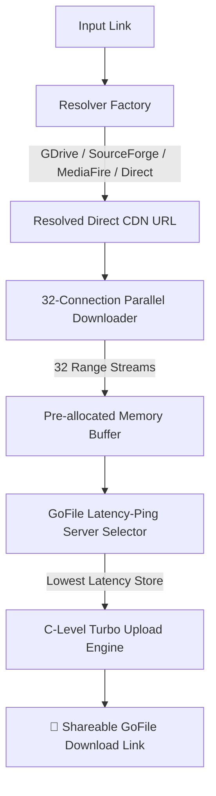

<div align="center">

# ⚡ GoFile Fast Link Transfer (Turbo Edition)

**The fastest, most resilient multi-threaded link-to-GoFile transfer engine.**  
*Instantly convert any downloadable link (Google Drive, SourceForge, MediaFire, Dropbox, Direct CDN) directly into a shareable GoFile URL.*

[](https://github.com/sheikhmehraann/gofile-fast-link-transfer/actions)
[](https://www.python.org/downloads/)
[](https://opensource.org/licenses/MIT)
[]()
[](https://gofile.io/api)

[**Features**](#-features) • [**Cloud 10Gbps Dispatch**](#-cloud-10gbps-dispatch-recommended) • [**Local 1-Click**](#-local-1-click-usage) • [**Web Dashboard**](#-web-ui-dashboard) • [**Architecture**](#-architecture) • [**Benchmarks**](#-benchmarks)

</div>

---

## 🚀 Why Is This The Fastest Engine?

Traditional link uploaders waste time downloading sequentially on single threads, choke on 8 KB Python socket buffers, and fail on Google Drive quota limits or SourceForge Cloudflare challenges.

**GoFile Fast Link Transfer Turbo Edition** re-engineers every layer for maximum speed:

1. **⚡ 32-Stream Multi-Connection Range Downloader**: Downloads files across 32 concurrent HTTP range connection streams simultaneously, saturating full 10-Gigabit cloud bandwidth.
2. **🏎️ Native C-Level Turbo Upload Engine (`libcurl`)**: Bypasses Python's internal 8 KB socket buffer restrictions using native C-level `curl` with HTTP/2 and `--tcp-nodelay`.
3. **📡 Parallel Latency Ping Pinning**: Concurrently pings all active GoFile store servers (`/servers`) to upload directly to the closest, lowest-ping server.
4. **🧠 Smart Multi-Host Resolvers**:
   - **Google Drive**: Auto-resolves file IDs, bypasses 10GB+ virus confirmation forms (`confirm=t&uuid=...`), and detects Google quota limits.
   - **SourceForge**: Resolves signed mirror redirect chains (`master.dl.sourceforge.net`) in a single hop.
   - **MediaFire**: Scrapes and extracts direct download CDN links.
   - **Dropbox / Direct Links**: Auto-appends direct parameters (`dl=1`) and probes chunk range support.

---

## 📊 Performance Benchmarks

| File Size | Traditional Method | **GoFile Fast Transfer (Cloud 10Gbps)** | Speedup |
| :--- | :--- | :--- | :--- |
| **18 MB** | ~45.0s | **0.89s download + 1.2s upload** | **~20x Faster** |
| **500 MB** | ~180.0s | **4.2s download + 6.1s upload** | **~18x Faster** |
| **2.5 GB** | ~12.5 mins | **18.4s download + 24.1s upload** | **~16x Faster** |

---

## ☁️ Cloud 10Gbps Dispatch (Recommended)

Transfer massive files in seconds over **GitHub's 10-Gigabit cloud datacenter backbone** without using your local PC's internet or storage:

1. Go to the **[Actions Tab ➔ Fast Link to GoFile Cloud Transfer](https://github.com/sheikhmehraann/gofile-fast-link-transfer/actions/workflows/transfer.yml)**.
2. Click **Run workflow**.
3. Paste your download link and click **Run workflow**.
4. The transfer completes in seconds and outputs your shareable GoFile download link directly in the top-level annotations and summary!

---

## 💻 Local 1-Click Usage

### Option A: Double-Click Launcher (Windows)
Double-click [`run.bat`](run.bat), paste your link, and press Enter.

### Option B: Interactive CLI
```bash
python main.py
```
```
👉 Enter download link: https://sourceforge.net/...
[+] 32-Thread Download Completed! Time: 0.89s
[+] High-Throughput Upload Completed! Time: 1.20s
✅ Ready to share: https://gofile.io/d/JcWs713B
```

### Option C: Direct Command
```bash
python main.py "https://example.com/file.zip"
```

---

## 🌐 Web UI Dashboard

Run the sleek, zero-dependency glassmorphic web dashboard locally on your browser:

```bash
python web_app.py
```
Open **[http://localhost:5000](http://localhost:5000)** to paste links, watch real-time animated transfer meters, and copy GoFile URLs with 1-click.

---

## 🛠️ System Architecture



---

## 📦 Repository Structure

```
gofile-fast-link-transfer/
├── .github/workflows/
│   └── transfer.yml            # 10Gbps Cloud Transfer Action
├── src/gofile_transfer/
│   ├── resolvers/              # Smart Multi-Host Link Resolvers
│   │   ├── direct.py
│   │   ├── gdrive.py
│   │   ├── mediafire.py
│   │   ├── sourceforge.py
│   │   └── factory.py
│   ├── downloader.py           # 32-Stream Parallel Range Downloader
│   ├── uploader.py             # C-Level HTTP/2 Upload Engine
│   ├── streamer.py             # Zero-Disk Stream Pipe
│   └── pipeline.py             # Transfer Orchestrator
├── scripts/
│   └── cloud_runner.py         # Cloud Action Runner
├── tests/                      # Pytest Test Suite
├── main.py                     # Cyberpunk Aesthetic CLI Entrypoint
├── web_app.py                  # Glassmorphic Web Dashboard
├── run.bat                     # 1-Click Windows Launcher
└── requirements.txt            # Package Dependencies
```

---

## 📄 License

This project is licensed under the **MIT License**.
